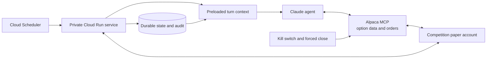

# Architecture

Status: Draft

## System diagram

## Preloaded turn context

Before invoking the model, the runtime assembles one compact, timestamped turn
context from durable state and fresh Alpaca reconciliation reads. It contains:

- market clock, session window, and evaluation timestamp
- session-starting equity, current equity, buying power, realized and unrealized
  P&L, daily loss headroom, and profit-stop state
- current positions, working orders, most recent close, and cooldown state
- the prior-session profile, compact daily narrative, and active reference levels
- current SPY price, session range, initial balance, recent completed bars, and
  feed freshness
- any unresolved thesis, decision, or order lifecycle state
- the applicable trading mandate, kill-switch state, and provenance timestamps

The snapshot is evidence, not a precomputed decision. Option-chain data is not
preloaded: it is larger, changes quickly, and is irrelevant to most turns.

## Daily narrative generation

The daily narrative is generated once after the first five-minute SPY bar closes
and before entries become eligible at 09:40 ET. Its only market inputs are:

- the most recent completed SPY regular session from historical SIP minute bars
- the current IEX regular-session opening print and its observed gap from the
  historical SIP prior close
- the opening location relative to prior range and value
- the first completed five-minute SPY bar from IEX

The generator calculates the prior-session profile and renders the same compact
AMT perception used by Augur. Claude returns the familiar `Contextual Analysis &
Plan` and `Levels of Interest` Markdown plus one structured `balanced`,
`above_structure`, or `below_structure` level map. Every selected price must
match a calculated reference. The completed narrative and structured levels are
cached and preloaded on each trading turn.

This slice does not load older sessions, retrieve similar narratives, or build a
knowledge corpus. Generation may retry once after an invalid response; if it
still fails, the agent receives the calculated profile without generated prose.

## Agent loop

The model receives the preloaded context, AMT mandate, trading policy, and tools.
It can record a hold without a tool call. After forming a directional thesis, it
may inspect a narrow option chain through Alpaca MCP, calculate quantity, and call
the relevant order tool directly. It uses targeted reads only when preloaded
state is stale or insufficient.

Alpaca-reported orders and positions remain execution truth. The runtime records
each structured decision and model-visible tool call automatically.

## Minimal operational controls

The experiment remains confined to the dedicated competition paper account:

- `ALPACA_PAPER_TRADE` must be true.
- Order submission defaults to disabled and requires an explicit enable switch.
- A durable kill switch prevents new model turns and cancels working entries.
- The forced-close backstop begins fifteen minutes before the Alpaca-reported
  session close if a position remains open.
- Every new order uses a deterministic `client_order_id` derived from its decision
  ID and action.

These controls protect operation of the demo. They do not form a second trading
policy or approval layer around the model.

## Order lifecycle

Alpaca reads reconcile state at the start of every turn and after each
account-changing call. The runtime looks up a deterministic client order ID
before retrying a lost submission. Partial fills become the authoritative
position immediately, and a position is not flat until Alpaca says it is. A
durable lease prevents concurrent turns from managing the account.

## Token economy

Complete API responses remain outside model context. The runtime compacts their
current state into the turn context; targeted tools return small structured
results, while raw responses remain available in the audit store.

An ordinary hold should require no tool calls. Context includes at most twelve
recent five-minute bars and eight narrowed option candidates, not an unfiltered
chain or prior conversation transcript. Concrete token and tool-call limits will
be set from observed runs rather than estimated in advance.

## Failure behavior

- A failed or stale Alpaca market read requires the agent to hold new entries.
- A failed account reconciliation prevents another account-changing tool call.
- A timeout after submission is resolved by client order ID and order lookup.
- A restart begins by reconciling Alpaca positions and working orders.
- The session-close backstop can flatten without waiting for another model turn.

## Deployment and scheduling

The MVP is one containerized FastAPI application deployed as a private Cloud Run
service. It does not use Cloud Functions. Cloud Scheduler invokes its HTTP
endpoints with an OIDC token from a service account that has only the Cloud Run
Invoker role. The service uses its own runtime identity for Firestore access.

Scheduler uses the `America/New_York` timezone. Its weekday schedules deliberately
cover a slightly wider window than the strategy. Every scheduled endpoint must
check the Alpaca calendar and clock before doing work, so holidays, early closes,
delayed requests, and manual invocations do not depend on cron being market-aware.

| Purpose | Schedule | Endpoint | Status |
| --- | --- | --- | --- |
| Daily narrative | 09:35 ET weekdays | `POST /narratives/generate` | Endpoint implemented; job not provisioned |
| Agent evaluation | Every five minutes during the RTH window | `POST /ticks/evaluate` | Planned |
| Normal-session close backstop | 15:45 ET weekdays | `POST /positions/flatten` | Planned |

The tick endpoint will acquire a Firestore lease keyed by trading date and
scheduled evaluation time before invoking the model. A retry or duplicate
Scheduler delivery therefore returns the existing decision instead of starting
a second turn. Narrative generation is similarly idempotent because its
Firestore document is keyed by trading date and created only once.

Each tick is self-contained: reconcile Alpaca account, order, position, clock,
and market state; load the narrative and durable session state; run the model;
persist the outcome; then end the request. The tick also compares the
Alpaca-reported close with the current time, so the forced-close path works on
early-close days. The separate 15:45 request is an additional normal-session
backstop.

The first MVP does not keep Alpaca WebSockets alive between requests. Scheduled
turns reconcile through Alpaca instead. If immediate order events later prove
necessary, the stream consumer can become a separate Cloud Run Job that starts
once each trading day and exits after the session, without changing the
request-driven tick and narrative interfaces.

The Python service exposes an HTTP generation endpoint and listens on the
platform-provided `PORT`, making it suitable for Cloud Run. Firestore stores one
immutable narrative document per trading date and will later hold decisions,
order events, leases, and current runtime state.
